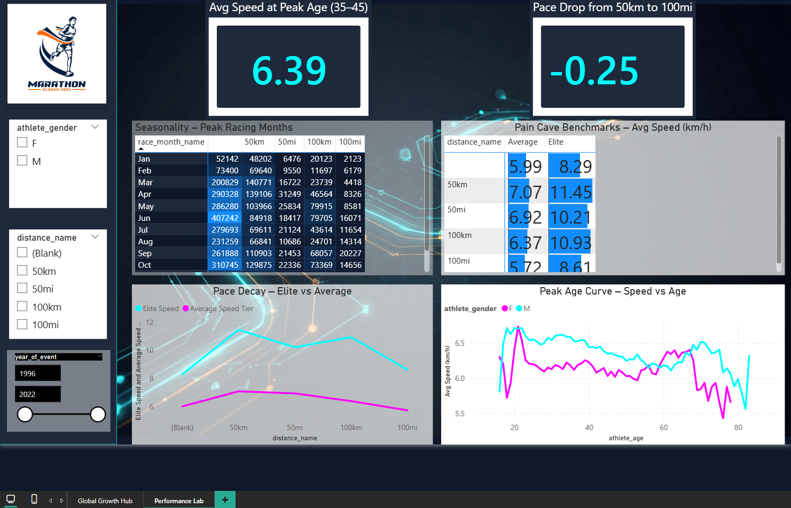

# 🏃 Ultra-Marathon Analytics Dashboard (1996–2022)


> **An end-to-end data engineering and business intelligence project analyzing 4.6 million ultra-marathon race records across 26 years (1996–2022).**

---

## 📊 Dashboard Preview

### Page 1 – Global Growth Hub


### Page 2 – Performance Lab


---

## 🎯 Problem Statement

Despite the explosive growth of ultra-running, there was no centralized, accessible analysis covering:

- **Global Participation** – Which countries drive the sport?
- **Demographic Shifts** – Is ultra-running becoming more inclusive by gender and age?
- **Performance Benchmarks** – What is a "good" time for a 50km vs 100-mile race?
- **Elite vs Amateur Gap** – How much faster are the pros, and how do they pace differently?

---

## 🔍 Key Insights

| # | Insight | Finding |
|---|---------|--------|
| 1 | **Hockey Stick Growth** | Ultra-marathon participation exploded post-2010, peaking at ~1M finishers/year before a sharp COVID-19 drop in 2020 |
| 2 | **France Dominates** | 🇫🇷 France leads global participation by a large margin, followed by 🇺🇸 USA and 🇯🇵 Japan |
| 3 | **Peak Endurance Age** | Athletes aged 35–45 average **6.39 km/h**, outperforming both younger and older runners |
| 4 | **Pace Decay is Real** | Runners are **~25% slower** in a 100mi race vs a 50km race (−0.25 decay index) |
| 5 | **Gender Gap Narrowing** | Female participation has grown steadily since 1996, though males still represent ~80% of finishers |
| 6 | **June is Peak Season** | June has the highest race volume across all distances (407K+ finishers), followed by October and May |
| 7 | **Elite Advantage** | Elite runners average **11.45 km/h** at 50km vs **7.07 km/h** for average runners — a **62% speed gap** |

---

## 🏗️ Architecture & Tech Stack

```
Raw Data (7.4M rows)
│
▼
[PySpark – Data Cleaning & Processing]
│
├── Deduplication (~2.5M duplicates removed)
├── Distance standardization (50km, 50mi, 100km, 100mi)
├── Feature engineering (athlete_age, avg_speed_kmh, tier)
└── Aggregation (yearly, country, seasonality, age, elite)
│
▼
[Processed CSVs – ~4.63M clean rows]
│
▼
[Power BI – Star Schema Data Model]
│
├── dim_athletes, dim_events, dim_date, dim_gender, dim_distance
├── agg_yearly, agg_country, agg_seasonality
├── agg_age_performance, agg_elite_vs_avg
└── DAX Measures (_measures table)
│
▼
[Interactive Dashboard – 2 Pages]
```

---

## 📁 Repository Structure

```
ultra-marathon-analytics/
│
├── 📄 README.md
│
├── 📁 data/
│   ├── raw/
│   │   └── README.md                  ← Download instructions (Kaggle link)
│   └── processed/
│       ├── dim_athletes.csv
│       ├── dim_events.csv
│       ├── dim_date.csv
│       ├── dim_gender.csv
│       ├── dim_distance.csv
│       ├── agg_yearly.csv
│       ├── agg_country.csv
│       ├── agg_seasonality.csv
│       ├── agg_age_performance.csv
│       └── agg_elite_vs_avg.csv
│
├── 📁 notebooks/
│   └── ultra_marathon_data_transformation.ipynb
│
├── 📁 powerbi/
│   ├── Ultra-Marathon-Dark-Theme.json  ← Power BI theme file
│   └── dax_measures.md                ← DAX documentation
│
├── 📁 docs/
│   ├── PRD.pdf
│   └── data_dictionary.md
│
├── 📁 screenshots/
│   ├── page1_global_growth_hub.png
│   └── page2_performance_lab.png
│
└── 📄 requirements.txt
```

---

## 📦 Dataset

| Property | Value |
|----------|-------|
| **Source** | [Kaggle – Two Centuries of Ultra Marathon Races](https://www.kaggle.com/datasets/aiaiaidavid/the-big-dataset-of-ultra-marathon-running) |
| **Raw Size** | ~7.4 million rows |
| **Cleaned Size** | ~4.63 million rows |
| **Time Span** | 1996 – 2022 |
| **Distances** | 50km, 50mi, 100km, 100mi |
| **Genders** | M, F |

> ⚠️ Raw data is not included in this repository due to file size.  
> Download `TWO_CENTURIES_OF_UM_RACES.csv` directly from Kaggle using the link above.

---

## 🔧 Data Processing Pipeline

### Step 1 – Cleaning (PySpark)
- Loaded 7,461,195 raw rows using Spark 4.1.1
- Removed ~2.5M duplicate records
- Filtered to standard distances only: 50km, 50mi, 100km, 100mi
- Retained valid years: 1996–2022
- Excluded gender "X" (< 50 records, insufficient for statistical analysis)

### Step 2 – Feature Engineering (PySpark)
- `athlete_age` – calculated from birth year and event year
- `avg_speed_kmh` – standardized from mixed units (validated range: 0–25 km/h)
- `distance_km` – converted miles to km for standardization
- `performance_seconds` – parsed from mixed `Xd HH:MM:SS` format into numeric
- `athlete_tier` – classified as "Elite" (top 10%) or "Average" based on gender-specific speed thresholds

### Step 3 – Aggregations (PySpark → CSV)
Five pre-aggregated tables exported to reduce Power BI model size by ~95%:

| Table | Dimensions | Metrics |
|-------|-----------|--------|
| `agg_yearly` | year, gender, distance | finishers, races, avg speed, avg age |
| `agg_country` | country, year | total finishers |
| `agg_seasonality` | month, distance | race count |
| `agg_age_performance` | age, gender, distance | avg speed, sample size |
| `agg_elite_vs_avg` | distance, gender, tier | avg speed, athlete count |

---

## 📐 Power BI Data Model

### Star Schema Design

```
dim_athletes ──────────────────────────────┐
dim_events  ───────────────────────────┐   │
dim_date    ───────────────────────┐   │   │
dim_gender  ───────────────────┐   │   │   │
dim_distance ──────────────┐   │   │   │   │
                           ▼   ▼   ▼   ▼   ▼
                agg_yearly (central fact table)
                agg_country
                agg_seasonality
                agg_age_performance
                agg_elite_vs_avg
```

See [`powerbi/dax_measures.md`](powerbi/dax_measures.md) for full DAX documentation.

---

## 📊 Dashboard Pages

### Page 1 – Global Growth Hub
> *Target audience: Race organizers, sponsors, general public*

- **4 KPI Cards** – Total Finishers (5M), Total Races (116K), Avg Speed (6.62 km/h), Avg Age (42.96)
- **Growth Chart** – Dual-axis showing the "Hockey Stick" growth of races and finishers (1996–2022) with COVID-19 annotation
- **Gender Participation Trends** – Stacked area chart showing the rise of female participation
- **Top 10 Countries** – Horizontal bar chart (France 🇫🇷 leads significantly)
- **Slicers** – Year range, gender, distance

### Page 2 – Performance Lab
> *Target audience: Coaches, athletes, data scientists*

- **2 KPI Cards** – Avg Speed at Peak Age 35–45 (6.39 km/h), Pace Drop 50km→100mi (−0.25)
- **Seasonality Heatmap** – Matrix of peak racing months by distance (June dominates)
- **Pace Decay Curve** – Elite vs Average speed comparison across all distances
- **Peak Age Curve** – Speed vs age by gender, highlighting endurance peak zone
- **Pain Cave Benchmarks** – Speed reference table for every distance and tier

---

## 🚀 How to Run

### Prerequisites
```
Python 3.8+
Apache Spark 3.x
Power BI Desktop (latest)
```

### Setup
```bash
# Clone the repository
git clone https://github.com/joalsebaey/ultra-marathon-analytics.git
cd ultra-marathon-analytics

# Install Python dependencies
pip install -r requirements.txt

# Download raw data from Kaggle
# Place TWO_CENTURIES_OF_UM_RACES.csv in data/raw/
```

### Run the Notebook
```bash
jupyter notebook notebooks/ultra_marathon_data_transformation.ipynb
```

### Open Dashboard
```
Open powerbi/Ultra_Marathon_Dashboard.pbix in Power BI Desktop
All processed CSVs from data/processed/ are pre-loaded
```

---

## 🔮 Future Work (V2.0)

- [ ] **Predictive Modeling** – ML model to predict finish time based on age, gender, and race history
- [ ] **Weather Integration** – Merge historical weather data to analyze DNF (Did Not Finish) rates
- [ ] **Individual Athlete Tracker** – Search bar to find specific athletes and view career progression
- [ ] **Route Difficulty Score** – Incorporate elevation data per event
- [ ] **Real-time Updates** – Connect to live race APIs for current-season data

---

## 📋 Requirements

See [`requirements.txt`](requirements.txt) for full list.

---

## 👤 Author

**Yousef Alsebaey**  
AI & Data Science Student  
📍 El Mansoura, Egypt  

[](https://github.com/joalsebaey)

---

## 📄 License

This project is licensed under the MIT License.

Dataset credits: [aiaiaidavid on Kaggle](https://www.kaggle.com/datasets/aiaiaidavid/the-big-dataset-of-ultra-marathon-running)

---

⭐ *If you found this project useful, please give it a star!*
